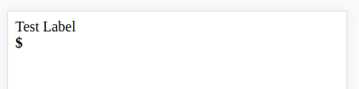

  

# ngx-inline-edit
Inline editing for Angular and Material

## Example 

Install `npm install @savantly/ngx-inline-edit`  

Include the module in your project -  

    import { BrowserModule } from '@angular/platform-browser';
	import { BrowserAnimationsModule } from '@angular/platform-browser/animations';
	import { NgModule } from '@angular/core';
	
	
	import { AppComponent } from './app.component';
	import { InlineEditModule } from '@savantly/ngx-inline-edit';
	
	
	@NgModule({
	  declarations: [
	    AppComponent
	  ],
	  imports: [
	    BrowserModule,
	    BrowserAnimationsModule,
	    InlineEditModule
	  ],
	  providers: [],
	  bootstrap: [AppComponent]
	})
	export class AppModule { }

Use the directive -  

    <inline-input-edit [label]="'Test Label'" [required]="true" [prefix]="'<b>$</b>&nbsp;'" [changed]="onChange"></inline-input-edit>

  

  

  

  